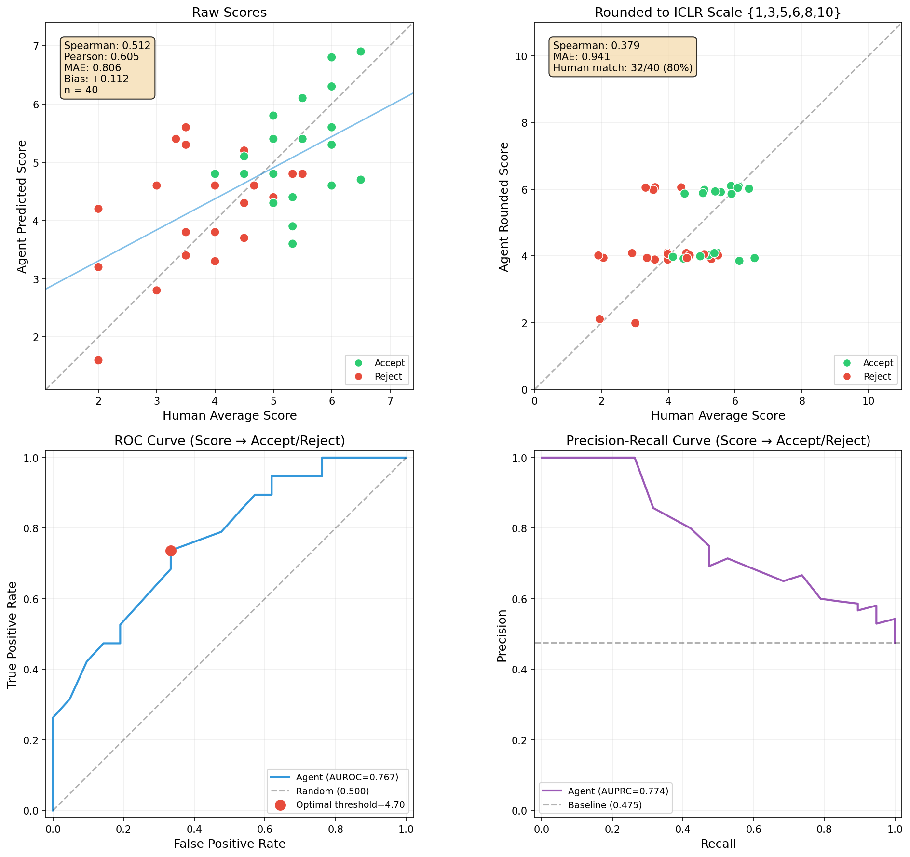

## Participate in Our Evaluation

We are looking for participants to help evaluate our review quality. If you are interested, please contact us at wg25r@student.ubc.ca.

# :pineapple:  Multi-Agent Paper Reviewer

An automated academic paper review system that uses multiple LLM agents with different roles to produce a consolidated review and score. Benchmarked against ICLR 2026 ground truth reviews.

## Architecture

```
Phase 1 (all parallel via OpenRouter chat completions):
  ├── Critical Reviewer ──── z-ai/glm-5
  ├── Supportive Reviewer ── z-ai/glm-5
  ├── Spark Finder ───────── z-ai/glm-5
  └── Related Work Scout ─── z-ai/glm-5:online → z-ai/glm-5 filter

Phase 2 (two-turn, separate models):
  ├── Turn 1: Merger ─────── z-ai/glm-5 via OpenRouter (consolidated review, no scores)
  └── Turn 2: Scorer ─────── z-ai/glm-5 via OpenRouter (calibrated score, review-only context)
```

**Agents:**

| Agent | Model | Role |
|-------|-------|------|
| Critical Reviewer | `z-ai/glm-5` | Section-by-section rubric review — raises genuine concerns, not nitpicks |
| Supportive Reviewer | `z-ai/glm-5` | Balanced assessment with strengths, weaknesses, novelty. Labeled "supportive/cheering" for the merger — strengths are cross-checked cautiously |
| Spark Finder | `z-ai/glm-5` | Identifies top 3-5 missing experiments, deeper analysis, obvious next steps |
| Related Work Scout | `z-ai/glm-5:online` | Proposes potentially missed references using OpenRouter's online model variant |
| Related Work Filter | `z-ai/glm-5` | Removes already-cited and loosely related results |
| Merger | `z-ai/glm-5` | Synthesizes all inputs into a final structured review (no scores) |
| Scorer | `z-ai/glm-5` | Scores the paper using the review + calibration examples (paper content stripped — only sees the review) |

All stages go through OpenRouter. To switch the scorer model, set `MODEL_SCORER` in `paper_reviewer.py` to another OpenRouter model ID.

## Review And Scoring Design

The merger acts as an area chair and applies several filters:

- **Nonsense filter**: Removes criticisms that are factually wrong or misunderstand the paper
- **Nitpick filter**: Drops formatting, style, and minor phrasing complaints
- **Scope check**: For every weakness, asks:
  1. Is this a *real* weakness or a *nice-to-have*?
  2. Could this omission be *intentional* (scope decision, space constraint)?
  3. Is this within the paper's stated scope?
- **Calibration**: Uses score distribution priors (~5% strong accept, ~40% borderline reject, ~30% clear reject) to prevent score inflation
- **Few-shot calibration** (optional): Injects real examples of multi-agent review bundles paired with human scores/decisions into the score predictor

Real weaknesses go in `"weaknesses"` and inform the final assessment. Nice-to-haves go in `"nice_to_haves"` and should not be treated like core flaws. The merger outputs a structured review with no scores (turn 1), then scores the paper in a second turn of the same conversation using calibration examples. This ensures the scoring agent has full context of its own review when assigning the score.

## Motivation

Prior academic review agents have several practical problems that this project tries to avoid.

CSPaper Review (CSPR) appears to rely on a forced-score style of review generation. It force the AI to generate a review for every single score in the score range (from 1-10) and then merge them. In practice, this design can encourage overly picky, internally inconsistent, or weakly grounded criticism, and may lead to contradictions across different parts of the review. Its related-work stage also appears to have relatively low precision, introducing a substantial amount of noisy or only weakly relevant feedback. Such noise can depress scores artificially and reduce the practical usability of the system for authors.

> Review agents: For each valid rating/score level defined by the target conference (e.g., 1-strong reject to 5-strong accept), we force a dedicated agent to (concurrently) generate reviews that strictly justify the assigned score/rating. A review selector identifies three most realistic reviews: best justified, more optimistic, and more critical. They are synthesized into a coherent output primarily based on the best-justified review but selectively incorporating insights from the other two versions. Finally, a calibration step ensures coherence between overall and sub-dimensional scores (e.g., novelty, clarity), ensuring a well-aligned and balanced final review.

CSPR's calibration approach also appears to depend heavily on semantic analysis of generated critiques. This is potentially problematic because the number of negative points raised in a review is not a reliable proxy for overall paper quality. A paper may elicit many minor comments without having serious flaws, while a substantially stronger paper may have only a few high-impact concerns. As a result, direct semantic aggregation of negative points can distort score calibration.

A broader issue in this literature is evaluation methodology. Many systems emphasize MAE or exact agreement with a human score, but these metrics can be misleading on imbalanced datasets. For example, on a non-balanced conference sample, an always-predict-6 baseline can already achieve deceptively strong performance. Without careful stratification, such evaluation protocols can overstate model quality. CSPR also appears to exhibit selection bias in paper collection, which further limits confidence in the reported results.

The Stanford review agent appears to encounter similar related-work precision issues. It also exhibits a failure mode in which the model may incorrectly treat papers, methods, or models outside its training timeline as fabricated and challenge the user on that basis. Its reported correlation results are also difficult to interpret, since the presentation partly relies on human-human agreement rather than a cleaner AI-to-human benchmark. More broadly, like CSPR, it is neither open source nor accompanied by a sufficiently detailed technical description, which makes the system difficult to inspect, explain, or validate.

The Stanford system also predicts sub-dimensional scores (novelty, soundness, clarity, etc.) and then uses linear regression to combine them into a final score. This design is fragile because LLMs tend to produce inflated, non-discriminative subscores due to sycophancy — without external anchor points or calibration, the subscores cluster in a narrow range (e.g., 6-8 out of 10) regardless of actual paper quality. When the input features to the regression are themselves uninformative, the final predicted score inherits that lack of discrimination. In contrast, our system avoids subscores entirely: the merger produces a qualitative review with no numerical ratings, and the final score is assigned in a separate step anchored by calibration examples with real human scores. This forces the scoring to be grounded in comparative quality rather than inflated self-assessments.

## Quick Start

```bash
# Clone
git clone https://github.com/weathon/review_agent.git
cd review_agent

# Install dependencies
pip install -r requirements.txt

# Set your OpenRouter API key
echo 'OPENROUTER_API_KEY="sk-or-..."' > .env

# For fetching ICLR 2026 papers, also add OpenReview credentials:
echo 'OPENREVIEW_USERNAME="your@email.com"' >> .env
echo 'OPENREVIEW_PASSWORD="yourpassword"' >> .env
```

## Usage

### Review a single paper

```bash
python paper_reviewer.py paper.txt --parallel --venue NeurIPS
python paper_reviewer.py paper.txt --parallel --no-related-work --no-spark
```

### Run the local Web UI

```bash
./run_webui.sh
```

Then open `http://127.0.0.1:7860`.

The UI is intentionally simple:
- no auth
- BYOK via an OpenRouter API key field in the page
- upload a `.pdf` / `.txt` / `.md` paper file, or paste paper text directly
- PDF parsing reuses the dataset builder parser from `fetch_iclr2025.py`
- toggles for parallel mode, related work, spark finder, and calibration

### Run everything (fetch → calibrate → benchmark)

```bash
./run_all.sh
```

This runs the full pipeline:
1. Fetches ICLR 2026 papers (balanced for calibration, unbalanced for testing)
2. Builds calibration set from balanced data (~10 papers, multi-agent review bundles paired with human scores)
3. Runs full reviewer benchmark on unbalanced data with calibration (50 papers, 3 concurrent)
4. Computes metrics + generates plots

### Step by step

```bash
# 1. Fetch ICLR 2026 papers (balanced for calibration, unbalanced for testing)
python fetch_iclr2026.py 100 42 --balanced --data-dir iclr2026_balanced
python fetch_iclr2026.py 100 42 --data-dir iclr2026_unbalanced

# 2. Build calibration set from balanced data
python build_calibration.py --data-dir iclr2026_balanced --parallel --no-related-work

# 3. Run benchmark on unbalanced data with calibration
python run_iclr_bench.py 50 3112 --parallel \
  --data-dir iclr2026_unbalanced --calibration calibration.md --no-related-work

# 4. Compute metrics
python metric.py bench_scores.csv
```

## Baselines

Four baselines are provided for comparison against the full multi-agent pipeline. Single-model baselines live under `baselines/`.

```
baselines/
├── always_predict_6/         # trivial baseline: always predicts score=6, Accept
│   └── run_baseline.py
├── direct_review/            # single-turn direct scoring (no review pipeline)
│   └── run_direct_baseline.py
└── structured_review/        # structured review matching merger sections
    ├── run_baseline.py
    └── build_calibration.py
```

### Always-predict-6 baseline (`baselines/always_predict_6/run_baseline.py`)

Predicts score=6 and decision=Accept for every paper. No model calls, no calibration. This is the trivial baseline — any useful system must beat it.

```bash
python baselines/always_predict_6/run_baseline.py 50 3112 --balanced --data-dir iclr2026_unbalanced --calibration calibration.md
```

The `--calibration` flag only excludes calibration paper IDs from sampling — no calibration context is used.

### Direct-scoring baseline (`baselines/direct_review/run_direct_baseline.py`)

Sends the paper directly to `MODEL_SCORER` and asks it to review and score in a single turn. No sub-agent reviews, no merger, no calibration. This measures what the scoring model can do on its own without any pipeline support.

```bash
python baselines/direct_review/run_direct_baseline.py 50 3112 --data-dir iclr2026_unbalanced
```

### Structured-review baseline (`baselines/structured_review/`)

A stronger single-model baseline that outputs the **exact same sections as the multi-agent merger** (Summary, Strengths, Weaknesses, Nice-to-Haves, Novel Insights, Potentially Missed Related Work, Suggestions) but without the agentic pipeline — no harsh/neutral/spark/related-work sub-agents, no merger synthesis.

This isolates the value of the multi-agent pipeline itself: if the full system outperforms this baseline, the improvement comes from multi-perspective synthesis rather than just the review format or scoring prompt.

Key differences from the simple review baseline:
- **Review format**: matches the merger output (7 structured sections vs 4 simple sections)
- **Scoring prompt**: uses the same comparative scoring procedure as the main pipeline (lower/upper bound identification, dimension-by-dimension comparison, interpolation)
- **Calibration format**: uses `# Final Consolidated Review` headers matching the main pipeline's calibration

```bash
# Build calibration
python baselines/structured_review/build_calibration.py --data-dir iclr2026_unbalanced

# Run benchmark
python baselines/structured_review/run_baseline.py 50 3112 --balanced \
  --data-dir iclr2026_unbalanced --calibration baselines/structured_review/calibration.md
```

### Comparison

| Method | Sub-agents | Review sections | Scoring method | Calibration |
|--------|-----------|-----------------|----------------|-------------|
| Always-predict-6 | None | N/A | Hardcoded 6 | None |
| Direct scoring | None | Brief assessment | Single-turn scoring guide | None |
| Structured review | None | Same 7 sections as merger | Comparative scoring (same as pipeline) | Own (`baselines/structured_review/calibration.md`) |
| Full pipeline | 4 specialized agents | Same 7 sections (via merger) | Comparative scoring | Multi-agent (`calibration.md`) |

## Calibration

The score predictor tends to overestimate scores. To fix this, we build a **calibration set**:

1. **Sample** 1 paper per score bin (+ extra from borderline bins 5 and 6)
2. **Run the full review stack** (critic, neutral, spark, related work, merger) on each calibration paper
3. **Pair** the resulting review bundle with real human reviewer scores and decisions
4. **Save** as `calibration.md` — injected into the score predictor prompt as few-shot examples

This shows the score predictor what "a paper that humans scored 3" vs "a paper that humans scored 8" looks like in terms of the assembled review bundle.

Calibration papers are excluded from both the benchmark and the baseline comparison set via `calibration_ids.json`.

## Dataset: ICLR 2026

Papers are fetched from OpenReview via authenticated API (`fetch_iclr2026.py`):
- Downloads PDFs using `client.get_pdf()` (auth required — OpenReview blocks anonymous downloads)
- Converts to markdown using `pymupdf4llm` with cleanup (strips line numbers, OCR artifacts, review headers)
- Withdrawn papers are kept and treated as Reject (they often have low scores that improve distribution coverage)
- Supports `--balanced` stratified sampling across score bins
- Supports `--data-dir` to output to a custom directory

### Evaluation methodology: balanced calibration, unbalanced testing

We use **balanced (stratified) sampling for calibration** and **unbalanced (natural distribution) sampling for testing**. This is the fairest setup:

- **Balanced calibration** ensures the scoring model sees anchor examples across the full score range (not just the 4-6 cluster that dominates the natural distribution), giving it well-distributed reference points.
- **Unbalanced testing** reflects the real-world score distribution, where ~70% of papers fall in the borderline 4-6 range. This prevents inflated correlation metrics that arise from balanced test sets, where the easy-to-predict extreme papers dominate the signal.

On the same model, same parser, and same year of data, balanced test sampling inflates Spearman from ~0.42 to ~0.70 purely because extreme-score papers are trivially easy to rank. MAE remains nearly identical (~2.4), confirming the model's actual scoring ability is the same — only the metric is inflated.

`run_all.sh` implements this: step 3 builds calibration from `iclr2026_balanced/`, step 5 tests on `iclr2026_unbalanced/`.

**Important leakage warning:** some source PDFs contain venue-status headers such as `Published as a conference paper at ICLR 2026`, which directly reveal acceptance status. The current pipeline removes both `Under review ...` and `Published as ...` status headers during text cleanup. For already-generated local datasets, run `python fix_paper_headers.py` before benchmarking.

More broadly, this is a general caution for any paper-review benchmark: metadata leakage can enter through parsed PDFs, repository mirrors, camera-ready headers, publication notices, or other artifacts that are not part of the original blind submission. Such leakage may not always produce obviously inflated accuracy, but it can still distort benchmarking results. Future benchmarks should explicitly audit and sanitize these signals before evaluation.

## Metrics

`metric.py` computes:
- **Spearman correlation** (raw and rounded to ICLR scale)
- **Pearson correlation**
- **MAE** (Mean Absolute Error)
- **Bias** (`mean(predicted_score - human_avg_score)`) to measure systematic under-scoring or over-scoring
- **Decision accuracy** (Accept/Reject match)
- **AUROC** (predicted score as discriminator for Accept vs Reject)
- **Optimal threshold** via Youden's J statistic
- **Borderline performance** (papers with GT avg 4-6)
- **Human match** (rounded prediction matches any individual reviewer)

For this project, **Pearson, MAE, bias, and decision quality are more important than Spearman**. Rank correlation is reported as a secondary metric, but it is highly sensitive to small local perturbations, especially in the borderline region where both human scores and accept/reject outcomes are inherently noisy. Since the main goal is calibrated scoring rather than exact global ranking, Pearson and bias are more informative about whether the model is using the same score scale as human reviewers.

Generates a 4-panel plot: raw scatter, rounded scatter, ROC curve, and precision-recall curve.

### Benchmark Results (ICLR 2026, unbalanced test set)



Results forthcoming — re-running on the new ICLR 2026 unbalanced test set with balanced calibration.

## Output Files

| File | Description |
|------|-------------|
| `bench_results.md` | Full reviews for each paper (written incrementally) |
| `bench_scores.csv` | Per-paper: predicted score, GT avg score, all GT reviewer scores, match |
| `bench_scores_scatter.png` | Scatter plot + ROC curve |
| `bench_run.log` | Complete stdout/stderr log of the run |
| `baseline_scores.csv` | Always-predict-6 baseline results (now at `baselines/always_predict_6/baseline_scores.csv`) |
| `direct_baseline_scores.csv` | Direct-scoring baseline results |
| `calibration.md` | Few-shot calibration examples (multi-agent review bundle + human scores) |
| `calibration_ids.json` | Paper IDs excluded from benchmark |
| `baselines/direct_review/` | Direct-scoring baseline results |
| `baselines/structured_review/scores.csv` | Structured-review baseline results |
| `baselines/structured_review/calibration.md` | Calibration for structured review baseline |
| `baselines/structured_review/calibration_ids.json` | Paper IDs excluded from structured review baseline |

## CLI Reference

### `paper_reviewer.py`

```
python paper_reviewer.py <paper.txt> [options]

  --parallel          Run all reviewers concurrently
  --no-related-work   Skip related work search + filter
  --no-spark          Skip spark finder
  --venue <name>      Set venue (ICLR, NeurIPS, ICML, etc.)
```

### `run_iclr_bench.py`

```
python run_iclr_bench.py [n] [seed] [options]

  --parallel              Run reviewers concurrently (within each paper)
  --balanced              Stratified sampling across score bins
  --data-dir <path>       Dataset directory (default: AI-Scientist/review_iclr_bench)
  --calibration <path>    Calibration file for few-shot score prediction
  --no-related-work       Skip related work agents
  --no-spark              Skip spark finder
```

### `build_calibration.py`

```
python build_calibration.py [seed] [options]

  --data-dir <path>       Dataset directory
  --parallel              Run review agents concurrently
  --no-spark              Skip spark finder
  --no-related-work       Skip related work search
```

### `baselines/always_predict_6/run_baseline.py`

```
python baselines/always_predict_6/run_baseline.py [n] [seed] [options]

  --balanced              Stratified sampling across score bins
  --data-dir <path>       Dataset directory
  --calibration <path>    Calibration file; excludes calibration IDs
```

### `run_direct_baseline.py`

```
python run_direct_baseline.py [n] [seed] [options]

  --balanced              Stratified sampling across score bins
  --data-dir <path>       Dataset directory
```

### `baselines/structured_review/run_baseline.py`

```
python baselines/structured_review/run_baseline.py [n] [seed] [options]

  --balanced              Stratified sampling across score bins
  --data-dir <path>       Dataset directory
  --calibration <path>    Calibration file (baselines/structured_review/calibration.md)
```

### `baselines/structured_review/build_calibration.py`

```
python baselines/structured_review/build_calibration.py [seed] [options]

  --data-dir <path>       Dataset directory
```

### `fetch_iclr2026.py`

```
python fetch_iclr2026.py [n] [seed] [options]

  --balanced        Stratified sampling across score bins
  --data-dir <path> Output directory (default: iclr2026_data)

Requires OPENREVIEW_USERNAME and OPENREVIEW_PASSWORD in .env
```

## Cost

Sub-agents, merger, and scorer use `z-ai/glm-5` via OpenRouter. Score parsing uses `gpt-5.4-nano` via OpenRouter. Exact cost depends on current pricing, paper length, and output length.
